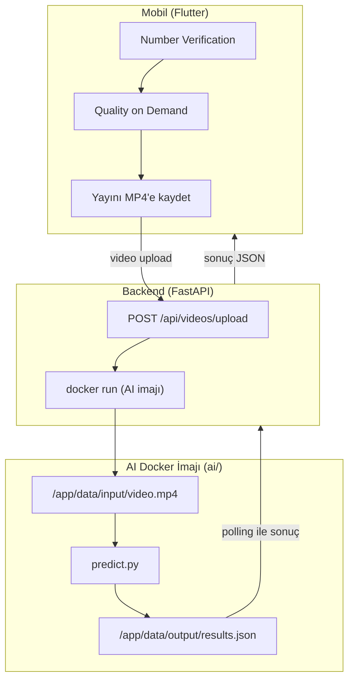

# 5G & Yapay Zekâ ile Akıllı Yol Güvenliği Yarışması

5G (Number Verification + Quality on Demand) ve yapay zekâ ile araç videosundan
plaka, renk ve kasa tipini, ayrıca sürücü/yolcu ihlallerini tespit eden yol güvenliği sistemi.


Proje, TEKNOFEST 2026 kapsamında düzenlenen **5G & Yapay Zekâ ile Akıllı Yol Güvenliği
Yarışması** için VST T1 takımı tarafından geliştirilmiştir.

## İçindekiler

1. [Teknoloji Yığını](#teknoloji-yığını)
2. [Mimari ve Proje Yapısı](#mimari-ve-proje-yapısı)
3. [Kurulum ve Başlangıç](#kurulum-ve-başlangıç)
4. [Kullanım](#kullanım)
5. [Konfigürasyon ve Ortam Değişkenleri](#konfigürasyon-ve-ortam-değişkenleri)
6. [API / Endpoint'ler](#api--endpointler)
7. [Testler](#testler)
8. [Teşekkürler](#teşekkürler)

## Teknoloji Yığını

| Katman | Teknolojiler |
|---|---|
| Mobil | Flutter (Dart SDK ^3.12.2), `dio`, `provider`, `video_player`, `ffmpeg_kit_flutter_new`, `webview_flutter`, `share_plus` |
| Backend | Python 3.12, FastAPI, Uvicorn, Pydantic v2 / pydantic-settings, httpx, python-multipart |
| AI | Python 3, PyTorch 2.3.1 (cu121), Ultralytics (YOLO) 8.4.115, MediaPipe, OpenCV 5.0, ffmpeg |
| Altyapı | Docker (backend: Docker-outside-of-Docker; AI: `nvidia/cuda:12.1.0`, iki aşamalı build), NVIDIA GPU |
| 5G | Turkcell Open Gateway (Number Verification, Quality on Demand) |
| Test | `pytest` (backend), `flutter test` (mobil) |

## Mimari ve Proje Yapısı

| Klasör | Rol |
|---|---|
| [`mobile/`](./mobile) | Flutter uygulaması: Number Verification, QoD, video kaydı/yükleme ve AI sonucunun gösterimi. Model çalıştırmaz, yalnızca orkestrasyon ve arayüzdür. |
| [`backend/`](./backend) | FastAPI. Mobil ile Turkcell Open Gateway arasında aracılık eder, video yüklenince AI imajını tetikler, sonucu mobile döner. Torch/opencv bağımlılığı yoktur. |
| [`ai/`](./ai) | Docker imajı (`teknofest-2026/vst-t1`). Videoyu okur, `results.json` yazar, sonlanır. Tek başına da çalıştırılabilir. |



```text
5g-vst-t1/
├── README.md
├── ai/                     # AI Docker imajı (teknofest-2026/vst-t1)
│   ├── main.py, Dockerfile, requirements.txt
│   ├── src/predict.py, utils.py
│   └── weights/            # Model ağırlıkları (git'e girmez)
├── backend/                # FastAPI orkestrasyon katmanı
│   ├── Dockerfile          # Backend'in kendi imajı (vst-t1-backend)
│   ├── app/api/            # Route'lar: auth, qod, videos, health
│   ├── app/services/       # network/ (Turkcell istemcisi), orchestration/ (AI çalıştırıcı)
│   └── tests/
└── mobile/                 # Flutter uygulaması
    ├── lib/                # config, models, screens, services, state, theme, widgets
    └── test/
```

## Kurulum ve Başlangıç

### Önkoşullar

| Parça | Gereksinim |
|---|---|
| Backend | Python 3.12, `pip` (Docker ile çalıştıracaksanız Docker) |
| Mobil | Flutter, Dart SDK ≥ 3.12.2, Android cihaz veya emülatör. Number Verification yalnızca hücresel veri bağlantılı gerçek bir SIM ile çalışır, Wi-Fi üzerinde Turkcell doğrulamayı reddeder |
| AI | Docker, NVIDIA GPU sürücüsü ve container toolkit (CUDA 12.1 uyumlu), `ai/weights/` altında model ağırlıkları |
| Genel | Git, Turkcell Open Gateway `client_id` / `client_secret` |

> Model ağırlıkları (`ai/weights/`) repoya dahil değildir. AI imajını build etmeden önce
> ağırlık dosyalarını bu klasöre koymanız gerekir.

### Hızlı başlangıç (yerel)

```bash
git clone https://github.com/akinmengee/5g-vst-t1.git
cd 5g-vst-t1
```

**1. Backend**

```bash
cd backend
python -m venv .venv
.venv\Scripts\activate            # Linux/macOS: source .venv/bin/activate
pip install -r requirements.txt   # hafif, ML bağımlılığı yok
# .env dosyasını oluşturun (bkz. Konfigürasyon ve Ortam Değişkenleri)
uvicorn app.main:app --reload
```

**2. Mobil**

```bash
cd mobile
flutter pub get
flutter run --dart-define=BACKEND_URL=http://localhost:8000
```

> Gerçek telefonda `localhost` telefonun kendisidir; `BACKEND_URL` olarak backend'in
> çalıştığı makinenin adresini (örneğin bilgisayarınızın yerel ağ IP'sini) verin.

**3. AI imajı**

```bash
docker build -t teknofest-2026/vst-t1:latest ai/
```

### Alternatif: backend'i Docker imajı olarak çalıştırma

Backend kendi içinden `docker run` ile AI imajını tetiklediği için host'un
`/var/run/docker.sock`'u ve `JOB_STORAGE_PATH`'in **host'taki path ile birebir aynı
path'te** container'a mount edilmesi şarttır.

```bash
docker build -t vst-t1-backend:latest backend/
docker run -d --name vst-t1-backend --restart unless-stopped \
  -p 8080:8080 \
  --env-file /home/<kullanici>/backend.env \
  -v /var/run/docker.sock:/var/run/docker.sock \
  -v /home/<kullanici>/jobs:/home/<kullanici>/jobs \
  vst-t1-backend:latest
```

### Alternatif: Android APK

```bash
cd mobile
flutter build apk --release --split-per-abi   # cihaz başına küçük APK (arm64 ~62 MB)
```

## Kullanım

Uygulamadaki akış: telefon numarasıyla Number Verification → "QoD Aç" → "Akış"
sekmesinde yayın adresini girip kayıt → backend'e yükleme ve Lifebox paylaşımı →
"AI Sonucu" ekranında tespitlerin görüntülenmesi.

Backend adresi ve yayın adresi çalıştırma zamanında verilir, koda gömülü değildir:

```bash
flutter run --dart-define=BACKEND_URL=http://<BACKEND_IP>:8080 \
            --dart-define=HLS_URL=https://.../playlist.m3u8 \
            --dart-define=PHONE=+90...      # NV alanını ön-doldurur (opsiyonel)
```

Yayın adresi uygulama içindeki "AKIŞ ADRESİ" alanından da değiştirilebilir, yeniden
build gerekmez.

AI imajını backend olmadan tek başına çalıştırmak için:

```bash
docker run --rm --gpus all \
  -v <video_klasoru>:/app/data/input \
  -v <cikti_klasoru>:/app/data/output \
  teknofest-2026/vst-t1:latest
# giriş: /app/data/input/video.mp4  →  çıkış: /app/data/output/results.json
```

**Yavaş bağlantıyı simüle etme (yalnızca test için, üretim build'inde kullanılmaz):**

```bash
flutter run --dart-define=TEST_REALTIME_PACE=true   # kayıt, yayının kendi bit hızında okunur
flutter run --dart-define=TEST_UPLOAD_KBPS=256      # yükleme yapay olarak kısıtlanır
```

**Örnek `results.json`:**

```json
{
  "video_id": "video.mp4",
  "arac_bilgisi": { "tip": "sedan", "plaka": "34ABC123", "renk": "beyaz", "confidence_score": 0.91 },
  "tespitler": [
    { "zaman_saniye": 12.5, "kategori": "sofor_eylemi", "etiket": "telefonla_konusma", "confidence_score": 0.87 }
  ]
}
```

`kategori`: `sofor_eylemi` | `nesneler` | `yolcular`. Etiketler ASCII ve küçük harftir
(`arkaya_bakma`, `esneme`, `sigara_icme`, `su_icme`, `telefonla_konusma`, `slalom`,
`etrafa_bakinma`, `emniyet_kemeri_ihlali`, `teknocan`, `bilgisayar`, `arka_koltuk_1`,
`arka_koltuk_2`, `on_koltuk`).

## Konfigürasyon ve Ortam Değişkenleri

Backend ayarları `.env` dosyasından veya shell'den okunur. Turkcell kimlik bilgileri
eksikse uygulama **açılışta** `RuntimeError` verir.

| Değişken | Varsayılan | Açıklama |
|---|---|---|
| `TURKCELL_API_BASE_URL` | boş | `https://opengateway.turkcell.com.tr` |
| `TURKCELL_CLIENT_ID` / `TURKCELL_CLIENT_SECRET` | boş | OAuth2 kimlik bilgileri (yalnızca backend'de tutulur) |
| `TURKCELL_REDIRECT_URI` | boş | Turkcell'e kayıtlı callback: `http://<BACKEND_IP>:8080/api/auth/callback` |
| `QOD_DURATION_SECONDS` | `1200` | QoD oturum süresi. Oturum bitince cihazın veri bağlantısı kopar, bu yüzden süre tüm kullanımı kapsamalıdır |
| `AI_DOCKER_IMAGE` | `teknofest-2026/vst-t1:latest` | Tetiklenecek AI imajı |
| `JOB_STORAGE_PATH` | `/srv/jobs` | Job giriş/çıkış klasörleri. **Windows'ta override edilmelidir** (örn. `./.local-jobs`) |
| `JOB_TIMEOUT_SECONDS` | `600` | AI çalıştırma üst sınırı (10 dk) |
| `FLOW_TTL_SECONDS` | `1200` | İşlem görmeyen NV/QoD flow'larının hafızadan düşme süresi |
| `JOB_RESULT_TTL_SECONDS` | `3600` | DONE/FAILED job kayıtlarının saklanma süresi |
| `LOG_LEVEL` | `INFO` | |

Örnek `.env` / `backend.env` şablonu (gerçek değerleri repoya **asla** eklemeyin):

```env
TURKCELL_API_BASE_URL=https://opengateway.turkcell.com.tr
TURKCELL_CLIENT_ID=<client_id>
TURKCELL_CLIENT_SECRET=<client_secret>
TURKCELL_REDIRECT_URI=http://<BACKEND_IP>:8080/api/auth/callback
JOB_STORAGE_PATH=./.local-jobs
AI_DOCKER_IMAGE=teknofest-2026/vst-t1:latest
LOG_LEVEL=INFO
```

Mobil tarafta yapılandırma `--dart-define` ile verilir: `BACKEND_URL`, `HLS_URL`,
`PHONE` (ve yalnızca test için `TEST_REALTIME_PACE`, `TEST_UPLOAD_KBPS`).

## API / Endpoint'ler

| Metot | Yol | Açıklama |
|---|---|---|
| `GET` | `/health` | `{"status": "ok"}` |
| `POST` | `/api/auth/login` | NV akışını başlatır (`flow_id` + `authorize_url`) |
| `GET` | `/api/auth/callback` | Turkcell'in yönlendirdiği OAuth callback |
| `GET` | `/api/auth/status/{flow_id}` | NV durumu (mobil poller) |
| `POST` | `/api/qod/start` | QoD oturumu açar (201 + `REQUESTED` = başarı); yanıtta Turkcell'in gerçekte verdiği `duration` döner |
| `POST` | `/api/qod/stop` | Oturumu erken kapatmayı dener (en iyi çaba) |
| `POST` | `/api/videos/upload` | Multipart (`flow_id` + `video`), `202` + `job_id` |
| `GET` | `/api/videos/{job_id}/result` | `status`: `PROCESSING` \| `DONE` \| `FAILED` + `results` (results.json) |

Örnek akış:

```bash
curl http://localhost:8000/health
# {"status":"ok"}

curl -F "flow_id=<flow_id>" -F "video=@video.mp4" http://localhost:8000/api/videos/upload
# 202 {"job_id": "..."}

curl http://localhost:8000/api/videos/<job_id>/result
# {"status": "DONE", "results": { ...results.json... }}
```

İstek/yanıt şemalarının tam hali `backend/tests/test_routes_*.py` dosyalarındadır.
Backend çalışırken Swagger arayüzü
`http://localhost:8000/docs` adresinde açılır (FastAPI varsayılanı).

## Testler

```bash
# Backend: ML bağımlılığı gerektirmez
cd backend
pip install -r requirements-dev.txt
python -m pytest -q

# Mobil: backend kapalıysa entegrasyon testleri kendini atlar
cd mobile
flutter test
flutter test test/backend_integration_test.dart   # gerçek servis kodu, gerçek backend
```

Kod üretimi (codegen) adımı yoktur. Otomatik testler uygulamanın mantığını doğrular;
gerçek ağ davranışı (yavaş bağlantıda kayıt ve yükleme süreleri gibi) için uygulamayı
gerçek bir cihazda denemek gerekir.

## Teşekkürler

- **TEKNOFEST** ve yarışma organizasyonu: senaryo, resmi dokümanlar ve Q&A süreci için.
- **Turkcell**: Open Gateway (Number Verification, Quality on Demand) erişimi ve test SIM'i için.
- **Akademik danışmanımız**: proje boyunca verdiği destek ve yönlendirme için.
- Bu projenin dayandığı açık kaynak çalışmalar:
  [Flutter](https://flutter.dev), [FastAPI](https://fastapi.tiangolo.com),
  [PyTorch](https://pytorch.org), [Ultralytics YOLO](https://github.com/ultralytics/ultralytics),
  [MediaPipe](https://github.com/google-ai-edge/mediapipe), [OpenCV](https://opencv.org),
  [FFmpeg](https://ffmpeg.org) ve [ffmpeg_kit_flutter_new](https://pub.dev/packages/ffmpeg_kit_flutter_new).

---

*Son güncelleme: 6 Ekim 2026.*
