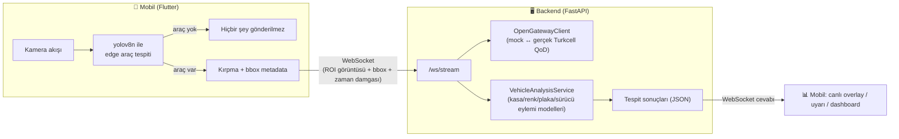

# 5G VST T1 — Akıllı Yol Güvenliği

**5G & Yapay Zekâ ile Akıllı Yol Güvenliği Yarışması** (Teknofest) kapsamında VST T1
takımının geliştirdiği sistem. Yol kenarı/mobil kamera görüntüsünden araç bilgisi
(plaka, renk, kasa tipi) ve sürücü/yolcu ihlallerini (telefon kullanımı, emniyet
kemeri, slalom, esneme, vb.) gerçek zamanlı tespit eder.

> **Takvim:** Final Yarışma Etabı **7-9 Ağustos 2026**, yüz yüze.

## İçindekiler

1. [Proje Hakkında](#proje-hakkında)
2. [Mimari](#mimari)
3. [Proje Yapısı](#proje-yapısı)
4. [Başlarken](#başlarken)
5. [Mock Veriyle Uçtan Uca Test](#mock-veriyle-uçtan-uca-test)
6. [Ortam Değişkenleri](#ortam-değişkenleri)
7. [Model Ağırlıkları](#model-ağırlıkları)
8. [Geliştirme Durumu ve Yol Haritası](#geliştirme-durumu-ve-yol-haritası)
9. [Takım](#takım)
10. [Daha Fazla Bilgi](#daha-fazla-bilgi)

## Proje Hakkında

Takım daha önce iki aşamayı tamamladı:

- **ÖTR (Ön Tasarım Raporu):** Mobil + 5G (Turkcell Open Gateway) + bulut tabanlı bir
  edge-to-cloud mimari önerildi (100 üzerinden 92 aldı, mimari özellikle övüldü).
- **FTR (Final Tasarım Raporu):** Yarışmanın otomatik değerlendirme ortamı (izole
  Docker, tek video dosyası, internet yok) gereği, ÖTR'nin mobil/5G kısmı olmadan,
  tek parça bir video-işleme yapay zekâ pipeline'ı teslim edildi (200 üzerinden 109 —
  raporu 90/100 ama kod tarafı 19/100). Bu pipeline'ın AI/CV kısmı test edilip
  kanıtlandı; `backend/app/services/vehicle_ai/_ftr_reference/` altında referans
  olarak duruyor.

**Şu an yaptığımız iş:** ÖTR'nin mimari vizyonunu (mobil edge tespiti + 5G + bulut) ile
FTR'de kanıtlanmış, çalışan AI pipeline'ını birleştirip, **7-9 Ağustos'taki yüz yüze
finalde gerçekten çalışan, canlı bir sistem** haline getirmek. Bu deponun (repo)
kapsamı budur.

Bu kararların *neden* böyle alındığına dair tüm gerekçe, tartışılan alternatifler ve
risk analizi için bkz. **[`PLAN.md`](./PLAN.md)** — bu README sadece "ne var, nasıl
çalıştırılır" sorularına cevap verir; "neden böyle" sorusu için PLAN.md'ye bakın.

## Mimari



**Neden böyle?** Mobil, her karede hafif bir modelle (`yolov8n.pt`, elde zaten var)
"araç var mı" diye bakar. Araç yoksa ağda hiçbir şey akmaz (event-driven). Araç
görülünce, sadece o bölge kırpılıp gönderilir ve aynı anda 5G QoD (Quality on Demand)
tetiklenir — böylece hem gecikme/ağ yükü azalır hem de "5G'yi gerektiğinde kullanma"
hikâyesi işlevsel olarak gerçek olur (backend'in kendisi tüm karede tarama yapsaydı,
bunu tetiklemek için zaten sürekli tam görüntü akıtmak gerekirdi). Detaylı gerekçe:
[`PLAN.md` → Mimari Kararlar madde 6](./PLAN.md#mimari-kararlar).

Backend tarafında iki dış bağımlılık (5G API'leri ve AI modelleri) bilinçli olarak
**arayüz (interface) arkasına** alındı, çünkü ikisi de yarışma günü/geç aşamada
değişecek/gelecek:

| Bağımlılık | Arayüz | Şu anki (mock/placeholder) | Gerçek (yarışma günü) |
|---|---|---|---|
| 5G Open Gateway (Number Verification, QoD) | `OpenGatewayClient` | `MockOpenGatewayClient` | `TurkcellOpenGatewayClient` |
| AI modelleri (kasa/renk/plaka/sürücü eylemi/slalom) | `VehicleAnalysisService` | boş/placeholder | `CurrentModelService` (Gün 4-7'de doldurulacak) |

Hangisinin aktif olduğu tek bir ortam değişkeniyle (`USE_MOCK_5G`) seçilir — kod
değişikliği gerekmez.

## Proje Yapısı

```text
5g-vst-t1/
├── PLAN.md                      # Tüm mimari kararlar, gerekçeler, risk analizi, gün gün plan
├── README.md                    # Bu dosya
├── backend/                     # FastAPI backend
│   ├── app/
│   │   ├── main.py                       # FastAPI giriş noktası
│   │   ├── core/config.py                # Ortam değişkenleri (USE_MOCK_5G, MODEL_DIR, ...)
│   │   ├── api/
│   │   │   ├── routes_health.py          # GET /health
│   │   │   └── routes_inference.py       # WS /ws/stream — mobilden ROI alır, tespit döner
│   │   ├── schemas/
│   │   │   ├── detection.py              # Yarışma çıktı şeması (FTR-docker-spec ile birebir)
│   │   │   └── mobile_contract.py        # Mobil → backend veri sözleşmesi (ROI + bbox + metadata)
│   │   ├── services/
│   │   │   ├── vehicle_ai/
│   │   │   │   ├── interface.py                # VehicleAnalysisService arayüzü
│   │   │   │   ├── current_model_service.py    # Gerçek implementasyon (şu an placeholder)
│   │   │   │   └── _ftr_reference/             # FTR'de teslim edilen orijinal kod (referans, DOKUNMA)
│   │   │   └── network/
│   │   │       ├── interface.py                # OpenGatewayClient arayüzü
│   │   │       ├── mock_client.py              # Sahte 5G implementasyonu (şu an aktif)
│   │   │       └── turkcell_client.py          # Gerçek Turkcell implementasyonu (yarışma günü doldurulacak)
│   │   └── fixtures/mock_mobile_payloads/       # Mobil kodu olmadan test için sahte veri üretici + istemci
│   ├── weights/                 # Model ağırlık dosyaları (.pt) — git'e eklenmez, bkz. aşağı
│   ├── Dockerfile
│   └── requirements.txt
├── mobile/                      # Flutter uygulaması (sonraki fazda doldurulacak)
└── docs/
    └── integration-notes.md     # Geliştirme sırasında çıkan kütüphane/entegrasyon notları
```

## Başlarken

Gereksinimler: Python 3.10+, Git.

```bash
git clone https://github.com/akinmengee/5g-vst-t1.git
cd 5g-vst-t1/backend

python -m venv .venv
.venv\Scripts\activate            # Windows
# source .venv/bin/activate       # macOS/Linux

pip install -r requirements.txt
```

> **Not:** `requirements.txt` GPU'lu (CUDA) PyTorch indirir, ilk kurulum büyük ve
> yavaş olabilir. Sadece backend iskeletini (henüz gerçek modeller olmadan) test
> edecekseniz şu hafif küme yeterli: `pip install fastapi "uvicorn[standard]"
> pydantic pydantic-settings python-multipart websockets opencv-python-headless numpy`

Sunucuyu çalıştırın:

```bash
uvicorn app.main:app --reload --app-dir .
```

Kontrol edin:

```bash
curl http://localhost:8000/health
# {"status": "ok"}
```

## Mock Veriyle Uçtan Uca Test

Henüz mobil (Flutter) kodu yazılmadı — bu aşamada backend'i, mobilin göndereceği
veriyi taklit eden sahte verilerle test ediyoruz.

```bash
# 1) Sunucu ayrı bir terminalde çalışıyor olmalı (yukarıdaki adım)

# 2) Sahte mobil verisi üret (bir aracın yaklaşmasını simüle eden 8 kare)
python -m app.fixtures.mock_mobile_payloads.generate_fixtures

# 3) Bu veriyi WebSocket üzerinden backend'e gönder, cevapları gör
python -m app.fixtures.mock_mobile_payloads.send_mock_stream
```

Her kare için backend'den gelen (şu an boş, çünkü gerçek modeller henüz bağlı değil)
JSON cevabını terminalde görürsünüz. Bu, mobil ↔ backend ↔ WebSocket boru hattının
uçtan uca çalıştığını kanıtlar.

## Ortam Değişkenleri

`.env` dosyasıyla veya doğrudan shell'den ayarlanabilir (bkz. `app/core/config.py`):

| Değişken | Varsayılan | Açıklama |
|---|---|---|
| `USE_MOCK_5G` | `true` | `false` → gerçek `TurkcellOpenGatewayClient` kullanılır (yarışma günü). |
| `MODEL_DIR` | `backend/weights` | Model ağırlıklarının bulunduğu klasör. |
| `TURKCELL_API_BASE_URL` | *(boş)* | Gerçek 5G Open Gateway API adresi (yarışma günü verilecek). |
| `TURKCELL_API_KEY` | *(boş)* | Gerçek 5G Open Gateway credential'ı (yarışma günü verilecek). |
| `LOG_LEVEL` | `INFO` | Log seviyesi. |

## Model Ağırlıkları

Aşağıdaki dosyalar `backend/weights/` klasörüne konulmalı (büyük binary dosyalar
oldukları için repoya eklenmiyor — `.gitignore`'a bakın, takım içi paylaşılmalı):

```
yolov8n.pt          yolov8s.pt           yolov8n-pose.pt      yolov8s-cls.pt
kasa_modeli.pt       renk_modeli.pt       plaka_modeli.pt      karakter_modeli.pt
kemer_v3.pt          sigara_v1.pt         su_v2.pt             telefon_temiz_v1.pt
teknocan.pt          slalom_lstm.pt       face_landmarker.task
```

Bu modellerin doğrulukları henüz şüpheli/doğrulanmamış (yarışma veri seti
paylaşılmadığı için) — güncellenmiş modeller geldiğinde sadece
`current_model_service.py` değişecek, geri kalan kod etkilenmeyecek.

## Geliştirme Durumu ve Yol Haritası

- [x] **Gün 0-1 — İskelet:** FastAPI iskeleti, veri sözleşmeleri (şemalar), arayüzler
  (`VehicleAnalysisService`, `OpenGatewayClient`) + mock implementasyonları, mock
  mobil veri üreticisi. **Tamamlandı ve doğrulandı** (yukarıdaki mock test).
- [x] **Gün 2-3 — Yürüyen iskelet:** Mock veri → WebSocket → backend → geçerli JSON
  cevabı uçtan uca çalışıyor.
- [x] **Gün 4-7 — Asıl mühendislik:** Batch/video-sonu mantığı gerçek zamanlı
  (incremental) hale getirildi, 15 modelin tamamı bağlandı (GPU), bilinen hatalar
  düzeltildi. **202 test geçiyor** — bunların çoğu, yeni streaming mantığının eski
  batch mantığıyla *birebir aynı* sonucu ürettiğini kanıtlıyor.
- [ ] **Gün 8-9 — Sağlamlaştırma:** Tespit eşiklerinin gerçek videoyla ayarlanması,
  gerçek telefonda test, kuru provalar, sunum hazırlığı.
- [ ] **Yarışma günü (7-9 Ağustos):** Gerçek Turkcell 5G API'lerinin ve (varsa) bulut
  ortamının bağlanması.

### Testleri çalıştırma

```bash
cd backend
pip install -r requirements-dev.txt
python -m pytest tests/ -q
```

- `tests/test_streaming_equivalence.py` — yeni gerçek-zamanlı dedektörlerin, FTR'de
  teslim edilen batch mantığıyla aynı sonucu ürettiğinin kanıtı (rastgele üretilmiş
  yüzlerce senaryo ile).
- `tests/test_service_pipeline.py` — ROI akışı mantığının uçtan uca doğrulaması
  (sahte modellerle, böylece beklenen tespitin çıkması *kesin* olarak test edilir).

Tüm bu adımların gerekçesi, alınan mimari kararlar, risk kaydı ve doğrulama planı için
bkz. **[`PLAN.md`](./PLAN.md)**.

## Takım

| Rol | Sorumluluk |
|---|---|
| Akademik Danışman | Proje takibi ve danışmanlık |
| Kaptan — Sunucu ve Veri Tabanı Mimarı | Backend mimarisi (bu repo) |
| 5G API Entegrasyonu | Turkcell Open Gateway (Number Verification, QoD) entegrasyonu |
| Yapay Zekâ / Görüntü İşleme | Model geliştirme, eğitim, doğruluk iyileştirme |
| Sistem Entegrasyonu ve Test | Uçtan uca test, saha provaları |
| Mobil Uygulama Geliştirici | Flutter uygulaması, uç birim (edge) optimizasyonu |

## Daha Fazla Bilgi

- **[`PLAN.md`](./PLAN.md)** — mimari kararlar, gerekçeler, kod incelemesi bulguları,
  risk kaydı, gün gün yapım planı. Projeye yeni katılan biri "neden böyle" sorusunun
  cevabını burada bulur.
- `backend/README.md` — backend'e özel kurulum/çalıştırma detayları.
- `backend/app/services/vehicle_ai/_ftr_reference/README.md` — FTR'de teslim edilen
  orijinal AI koduna dair not.
