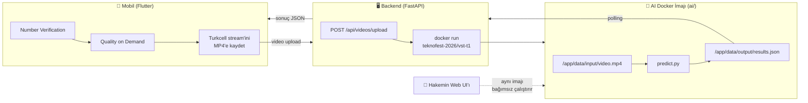

# 5G VST T1 — Akıllı Yol Güvenliği

**5G & Yapay Zekâ ile Akıllı Yol Güvenliği Yarışması** (Teknofest) kapsamında
VST T1 takımının final için geliştirdiği sistem. Mobil uygulama üzerinden
Number Verification → Quality on Demand → video yükleme akışını yürütür;
video, ayrı bir Docker imajındaki AI pipeline'ında işlenip araç bilgisi
(plaka, renk, kasa tipi) ve sürücü/yolcu ihlalleri (telefon kullanımı,
emniyet kemeri, slalom, esneme, vb.) tespit edilir.

> **Takvim:** Final Yarışma Etabı **7-9 Ağustos 2026**, yüz yüze.

## İçindekiler

1. [Proje Hakkında](#proje-hakkında)
2. [Mimari](#mimari)
3. [Proje Yapısı](#proje-yapısı)
4. [Başlarken](#başlarken)
5. [Durum ve Yol Haritası](#durum-ve-yol-haritası)
6. [Takım](#takım)
7. [Daha Fazla Bilgi](#daha-fazla-bilgi)

## Proje Hakkında

Sistem üç bağımsız parçadan oluşuyor:

- **`mobile/`** — Flutter uygulaması. Number Verification, Quality on
  Demand, video kaydı/yükleme ve AI sonucunun gösterimi. Hiçbir AI/model
  işi yapmaz, yalnızca orkestrasyon ve arayüz.
- **`backend/`** — FastAPI. Mobil ile Turkcell Open Gateway arasında
  aracılık eder, video yüklenince AI imajını tetikler, sonucu mobile
  döner. Kendi torch/opencv bağımlılığı yoktur — ince bir katmandır.
- **`ai/`** — Hakemin de bağımsız olarak çalıştıracağı Docker imajı
  (`teknofest-2026/vst-t1`). Videoyu okur, `results.json` yazar, sonlanır.

Bu üçlü ayrışma **3 Ağustos 2026'da organizasyondan gelen 9 resmi
dokümanın** (Final Yarışma Senaryosu, FTR teslim dokümanı, Turkcell Open
Gateway spesifikasyonları, Operasyon Rehberi vb.) tarif ettiği resmi final
akışına birebir dayanıyor. Projenin daha önceki bir sürümü farklı bir
mimari (mobilde edge AI + WebSocket) izliyordu; bu mimari organizasyonun
resmi akışıyla çeliştiği için tamamen terk edildi — bugün kodda veya
dokümanlarda bundan hiçbir iz yok.

Kararların *neden* böyle alındığına, tamamlanan işlere ve yol haritasına
dair detay için bkz. **[`PLAN.md`](./PLAN.md)**.

## Mimari



Backend'deki tek dış bağımlılık (Turkcell Open Gateway) arayüz arkasında:
mock ↔ gerçek arası `USE_MOCK_5G` ortam değişkeniyle seçilir, kod
değişikliği gerekmez. AI çıktısı için sahte bir mod **yoktur** — video her
zaman gerçek `ai/` imajına gider.

## Proje Yapısı

```text
5g-vst-t1/
├── PLAN.md                 # Mimari kararlar, yol haritası, açık riskler — TEK doğruluk kaynağı
├── note.md                 # Kod inceleme / bug düzeltme geçmişi (kronolojik)
├── README.md
├── ai/                     # Hakemin çalıştıracağı Docker imajı (teknofest-2026/vst-t1)
│   ├── main.py, Dockerfile, requirements.txt
│   ├── src/predict.py, utils.py
│   └── weights/            # Model ağırlıkları (git'e girmez)
├── backend/                # FastAPI orkestrasyon katmanı
│   ├── Dockerfile          # Backend'in kendi imajı (vst-t1-backend, teknofest-2026/ öneksiz)
│   └── app/api/, services/network/, services/orchestration/
└── mobile/                 # Flutter uygulaması
    └── lib/
```

Not: `docs/mobile-integration.md` / `docs/ai-integration.md` 6 Ağustos'ta
kaldırıldı — sözleşmeler artık kod + testlerle kanıtlanıyor (bkz. `PLAN.md`
"Neden Mimari Değişti").

## Başlarken

Her parçanın kendi kurulum/çalıştırma talimatı kendi klasöründe:

- **Backend:** [`backend/README.md`](./backend/README.md) — yerel
  `uvicorn app.main:app --reload` ile ya da kendi Docker imajıyla
  (`backend/Dockerfile`, VM'de kullanılan yöntem) çalıştırılabilir; ortam
  değişkenleri, endpoint listesi, test komutları orada.
- **Mobil:** [`mobile/README.md`](./mobile/README.md) — `flutter run
  --dart-define=BACKEND_URL=...` (+ `--dart-define=HLS_URL=...` final
  günü stream adresi değişirse), bilinen platform kısıtları (Windows
  masaüstünde NV WebView test edilemez — `webview_flutter` yalnızca
  Android/iOS destekliyor).
- **AI:** `docker build -t teknofest-2026/vst-t1:latest ai/` ile imaj
  build edilir; çalışma sözleşmesi, açık riskler ve doğrulama durumu
  [`PLAN.md`](./PLAN.md)'de.

Üçünü birlikte, gerçek bir backend + gerçek AI imajına karşı test etmek
için:

```bash
cd backend
JOB_STORAGE_PATH=./.local-jobs USE_MOCK_5G=true python -m uvicorn app.main:app --port 8000
```

```bash
cd mobile
flutter run --dart-define=BACKEND_URL=http://localhost:8000
```

## Durum ve Yol Haritası

- [x] **Backend ↔ Mobil** — NV/QoD/video akışının tamamı gerçek HTTP ile
  uçtan uca doğrulandı (yerelde, VM'de bare process olarak, VM'de
  container olarak — üçü de birebir aynı sonuç).
- [x] **AI imajı** — build alıyor, GPU'da (Tesla T4) çalışıyor, gerçek
  yarışma videosundan şema-geçerli sonuç üretiyor.
- [x] **Uçtan uca** — mobil servis kodu → backend → gerçek AI imajı →
  sonuç zinciri baştan sona kanıtlandı.
- [x] **Backend, kendi Docker imajı olarak VM'de çalışıyor**
  (`vst-t1-backend`, `teknofest-2026/` öneksiz), `--restart
  unless-stopped` ile çökme/reboot sonrası kendiliğinden ayağa kalkıyor —
  gerçek bir çökme simüle edilerek doğrulandı.
- [x] **VM doğrulaması (Faz C) 4/4 tamamlandı** — organizasyonun Web
  UI'ından proje oluşturulup Execute çalıştırıldı, `EXECUTION COMPLETED –
  status: SUCCESS` alındı. İmaj boyutu için resmî bir sınır **yok**
  (önceki "8GB FTR limiti" iddiası yalnızca FTR-fazına özel bir
  dokümandan geliyordu, Final'e uygulanmıyor — organizasyon Q&A'sinde
  netleşti). Çalışma süresi rahat (1080p için 436sn, limit 600sn) —
  gerçek stream'de zaten 4K yok, yalnızca 1080p/240p.
- [ ] **Turkcell `client_id`/`secret`** — organizasyondan hâlâ gelmedi.
- [ ] **7 Ağustos 21:00** — AI imajı dondurulup SHA256 alınacak; sonra
  gerçek Turkcell erişimi açılınca `USE_MOCK_5G=false` ile tam kuru prova.

Detaylı yol haritası, açık riskler, organizasyon Q&A netleştirmeleri ve
PDF-PDF sistematik doğrulama sonuçları için bkz. **[`PLAN.md`](./PLAN.md)**;
düzeltilen bug'ların dosya/satır referanslı kaydı için **[`note.md`](./note.md)**.

## Takım

| Rol | Sorumluluk |
|---|---|
| Akademik Danışman | Proje takibi ve danışmanlık |
| Kaptan — Sunucu ve Veri Tabanı Mimarı | Backend mimarisi (bu repo) |
| 5G API Entegrasyonu | Turkcell Open Gateway (Number Verification, QoD) entegrasyonu |
| Yapay Zekâ / Görüntü İşleme | AI pipeline'ı, model geliştirme, doğruluk iyileştirme |
| Sistem Entegrasyonu ve Test | Uçtan uca test, saha provaları |
| Mobil Uygulama Geliştirici | Flutter uygulaması |

## Daha Fazla Bilgi

- **[`PLAN.md`](./PLAN.md)** — mimari kararlar, gerekçeler, tamamlanan
  işler, yol haritası, açık riskler, organizasyon Q&A netleştirmeleri,
  doğrulama planı.
- **[`note.md`](./note.md)** — düzeltilen/açık bug'ların dosya:satır
  referanslı, kronolojik kaydı.
- **[`backend/README.md`](./backend/README.md)**,
  **[`mobile/README.md`](./mobile/README.md)** — parçaya özel kurulum,
  endpoint'ler, ortam değişkenleri ve bilinen kısıtlar.
